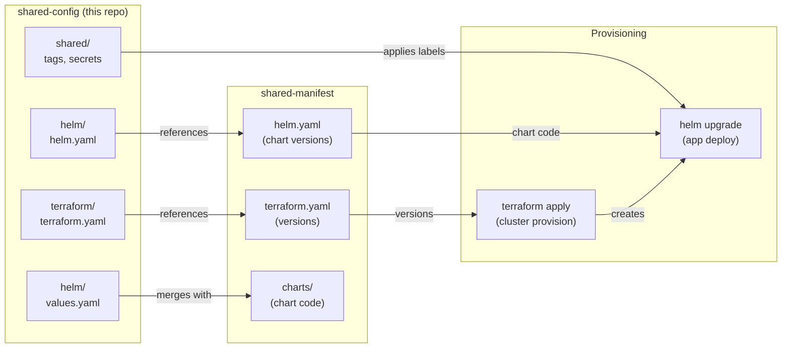
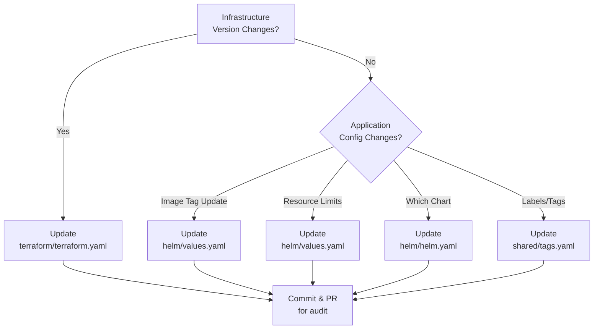

# Shared Config Repository

This repository contains **environment-specific inputs**: what values, overrides, and settings apply to THIS environment. Think of it as your "environment knobs and dials."

## Two Configuration Categories: Terraform and Helm

### Terraform Configuration

**When:** Provisioning infrastructure - cluster setup, namespaces, storage.

**What you configure:**
- Backend targets (where state is stored)
- Infrastructure variables (cluster name, node count, versions)
- Any terraform-specific overrides for this environment

**Files:**
- `terraform/terraform.yaml` - What infrastructure versions/settings this environment uses
- `terraform/backend/local.tfvars.json` - Backend config (where to store tfstate)

**Example - Scaling Infrastructure:**
```yaml
# terraform.yaml
cluster:
  name: 'dev-cluster'
  node_count: 1          # dev has 1 node
```

vs production might have:
```yaml
cluster:
  name: 'prod-cluster'
  node_count: 3          # prod has 3 nodes
```

### Helm Configuration

**When:** Deploying applications to the cluster.

**What you configure:**
- Which Helm charts to deploy (via manifest reference)
- Application versions (image tags per environment)
- Resource limits (dev can be smaller than prod)
- Overrides (password, replicas, storage size)

**Files:**
- `helm/helm.yaml` - Pointer to manifest (which charts to use)
- `helm/values.yaml` - Environment-specific value overrides

**Example - Application Versions:**
```yaml
# helm/values.yaml (dev environment)
monitoring:
  grafana:
    replicas: 1
  influxdb:
    storage: 10Gi
```

vs production:
```yaml
# helm/values.yaml (prod environment)
monitoring:
  grafana:
    replicas: 3
  influxdb:
    storage: 100Gi
```

## Configuration Flow



## File Purposes

### terraform/terraform.yaml
Points to what infrastructure versions this environment uses and any overrides.
```yaml
# Example
cluster:
  name: 'dev-cluster'
  image: 'kindest/node:v1.33.0'
database_name: 'dev_db'
namespace: 'default-apps'
```

### terraform/backend/local.tfvars.json
Backend configuration (where terraform state is stored).
```json
{
  "path": ".terraform/tfstate/dev-cluster"
}
```

### helm/helm.yaml
**Reference only** - points to which manifest release declarations to use.
Does NOT include chart code (that's in shared-manifest).

### helm/values.yaml
**Environment overrides** for Helm deployments. Not all values needed here—only the ones that differ from chart defaults.

### shared/tags.yaml
Common resource labels for all infrastructure in this environment.
```yaml
tags:
  ManagedBy: terraform
  Environment: dev
  Team: platform
```

### shared/secrets.yaml
References to secrets (not hardcoded). Usually injected via environment variables.
```yaml
# Example (actual values never in repo)
database:
  password: "${DB_PASSWORD}"  # injected at runtime
```

## When to Update What



## Environment Examples

**dev environment** `deploy/k8s-cluster/dev/`:
- Small cluster (1 node, minimal storage)
- Simple chart setup (1 replica per app)
- Fast deploy, not HA

**prod environment** `deploy/k8s-cluster/prod/`:
- Large cluster (3+ nodes, ample storage)
- Replicated apps (3+ replicas)
- HA setup, auto-scaling possible

Both use the SAME charts from shared-manifest, just with different values here.

## Key Principles

- **Never duplicate code** - Charts live in shared-manifest only
- **Everything is auditable** - Config changes are version-controlled
- **Minimal per-environment** - Only override what differs from defaults
- **Reference explicit versions** - Know exactly which chart/terraform version deployed
- **Secrets injected** - Never hardcode passwords; use environment variables
